<div align="center">
  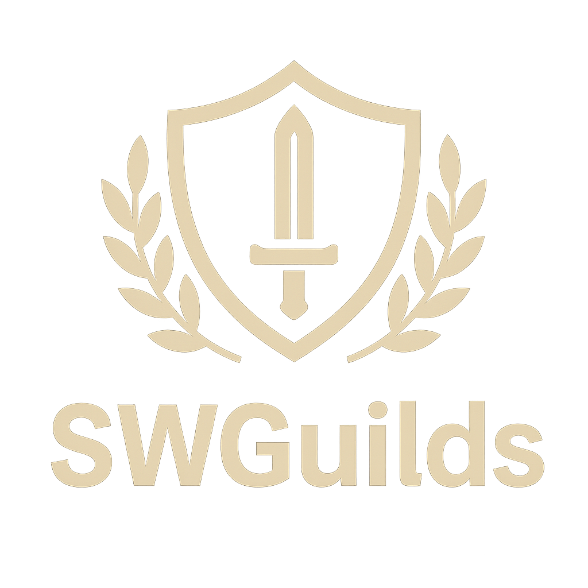
  
  **Application web complète pour la gestion de guilde Summoners War**
  
  [](https://www.docker.com/)
  [](https://nextjs.org/)
  [](https://www.typescriptlang.org/)
  []()
</div>

Cette documentation est disponible en [Français](README.fr.md) et en [Anglais](README.md)

---
## 🎯 À propos

**SWGuilds** est une application web full-stack conçue pour aider les guildes de **Summoners War: Sky Arena** à gérer efficacement leurs défenses, contres, calendrier, carte de guilde et bien plus encore.

L'application offre une interface moderne et intuitive, disponible en français et en anglais, avec un système de permissions granulaires pour une gestion optimale de votre guilde.

---

## 📋 Table des matières

- [Fonctionnalités](#-fonctionnalités)
- [Captures d'écran](#-captures-décran)
- [Installation rapide avec Docker](#-installation-rapide-avec-docker)
- [Configuration](#-configuration)
- [Utilisation](#-utilisation)
- [Technologies utilisées](#-technologies-utilisées)
- [Maintenance et dépannage](#-maintenance-et-dépannage)
- [Support](#-support)

---

## ✨ Fonctionnalités

### 🛡️ Gestion des défenses

- **CRUD complet** : Créez, modifiez, supprimez et consultez toutes vos défenses
- **Système de tags** : Organisez vos défenses avec des étiquettes personnalisées
- **Notes détaillées** : Ajoutez des notes sur les forces, faiblesses
- **Votes** : Système de likes/dislikes pour évaluer les défenses

**Accès** : Menu "Défenses" → Créer une nouvelle défense

### ⚔️ Système de contres

- **Contres par défense** : Ajoutez plusieurs contres pour chaque défense
- **Détails complets** : Notes, monstres utilisés, créateur et date de création
- **Système de votes** : Les membres peuvent liker/disliker les contres pour identifier les meilleures stratégies
- **Historique** : Suivez qui a créé et modifié chaque contre

**Accès** : Depuis la page d'une défense → Onglet "Contres"

### 📅 Calendrier

- **Gestion des absences** : Enregistrez les absences des membres de la guilde
- **Événements personnalisés** : Créez des événements personnalisés avec notes
- **Vue mensuelle** : Affichage mensuel avec support des événements multi-jours
- **Notifications Discord** : Option pour envoyer des notifications Discord lors de la création d'absences
- **Gestion multi-utilisateurs** : Les administrateurs peuvent créer des événements pour d'autres membres

**Accès** : Menu "Calendrier"

### 🗺️ Carte interactive

- **Plan de guilde** : Visualisez et gérez votre plan de guilde avec une carte interactive
- **Tours draggables** : Déplacez et redimensionnez les tours directement sur la carte
- **Assignation de défenses** : Assignez des défenses spécifiques à chaque tour
- **Modes de carte** : Support pour carte normale et carte de tournoi
- **Assignation d'utilisateurs** : Assignez des membres à des tours spécifiques

**Accès** : Menu "Carte"

### 👥 Gestion des affectations

- **Affectation de défenses** : Assignez des défenses spécifiques à plusieurs membres de la guilde
- **Vérification automatique** : Le système vérifie automatiquement quels membres possèdent les monstres nécessaires pour chaque défense
- **Affectations multiples** : Assignez une même défense à plusieurs membres simultanément
- **Gestion des affectations** : Consultez toutes les affectations existantes ou filtrez pour voir uniquement vos affectations
- **Modification** : Modifiez ou supprimez les affectations existantes
- **Vue d'ensemble** : Visualisez toutes les défenses assignées avec les monstres et les membres concernés
- **Permissions** : Contrôle d'accès via la permission `canEditAssignments`

**Accès** : Menu "Gestion" (permission `canEditAssignments` requise pour créer/modifier)

### 👹 Base de données des monstres

- **Recherche avancée** : Recherchez parmi tous les monstres de Summoners War
- **Filtres** : Filtrez par attribut, type, famille, etc.
- **Images Swarfarm** : Accès aux images officielles depuis Swarfarm
- **Cache local** : Les images sont mises en cache pour un chargement rapide
- **Upload JSON** : Importez vos monstres depuis SWExporter (via JSON)

**Accès** : Menu "Monstres"

### 📰 Actualités (News)

- **Système de posts** : Créez et gérez des actualités pour votre guilde
- **Markdown supporté** : Utilisez Markdown pour formater vos posts
- **Webhook Discord** : Option pour publier automatiquement sur Discord
- **Gestion des permissions** : Contrôlez qui peut créer des posts

**Accès** : Menu "News" (permission requise pour créer)

### 👥 Gestion des utilisateurs

- **Système de rôles** : Administrateurs et utilisateurs standards
- **Approbation** : Les nouveaux utilisateurs doivent être approuvés par un admin
- **Permissions granulaires** :
  - `canEditAllDefenses` : Modifier toutes les défenses
  - `canEditMap` : Modifier la carte de guilde
  - `canEditAssignments` : Gérer les assignations
  - `canEditNews` : Créer des posts d'actualités
- **Profils personnalisés** : Avatar, nom, langue préférée
- **Clés API** : Génération de clés API pour SWExporter

**Accès** : Panel d'administration (admin uniquement)

### 🔧 Administration

- **Panel complet** : Interface d'administration complète
- **Gestion des utilisateurs** : Création, modification, suppression, approbation
- **Logs d'activité** : Suivez toutes les actions des utilisateurs
- **Export de base de données** : Exportez votre base de données pour sauvegarde
- **Paramètres** : Configuration du logo, nom d'instance, webhooks Discord
- **Compte admin protégé** : Le compte créé via variables d'environnement est protégé

**Accès** : Menu "Administration" (admin uniquement)

### 🌐 Multilingue

- **Support FR/EN** : Interface disponible en français et en anglais
- **Préférence utilisateur** : Chaque utilisateur peut choisir sa langue préférée
- **Configuration globale** : Langue par défaut configurable via variables d'environnement

### 🔐 Authentification

- **Inscription** : Les nouveaux utilisateurs peuvent s'inscrire
- **Connexion sécurisée** : Authentification via NextAuth.js
- **Gestion de profil** : Modification du profil, avatar, mot de passe
- **Sessions** : Gestion automatique des sessions

---

## 📸 Captures d'écran

| Fonctionnalité | Capture d'écran |
|----------------|-----------------|
| 🔐 **Authentification** - Page de connexion | 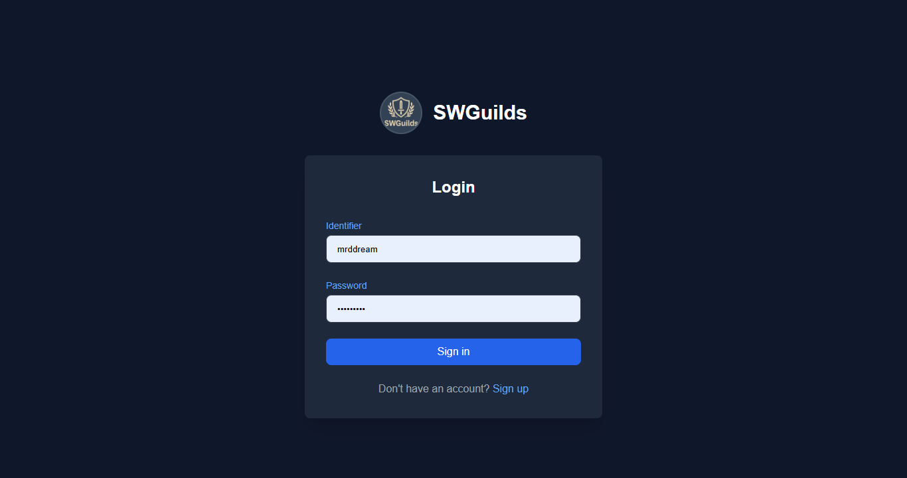 |
| 📰 **Actualités** - Page des actualités | 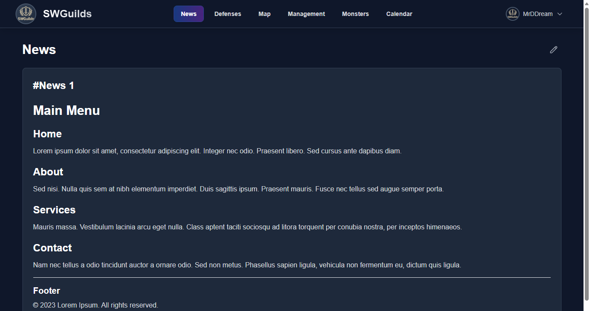 |
| 🛡️ **Défenses** - Liste des défenses | 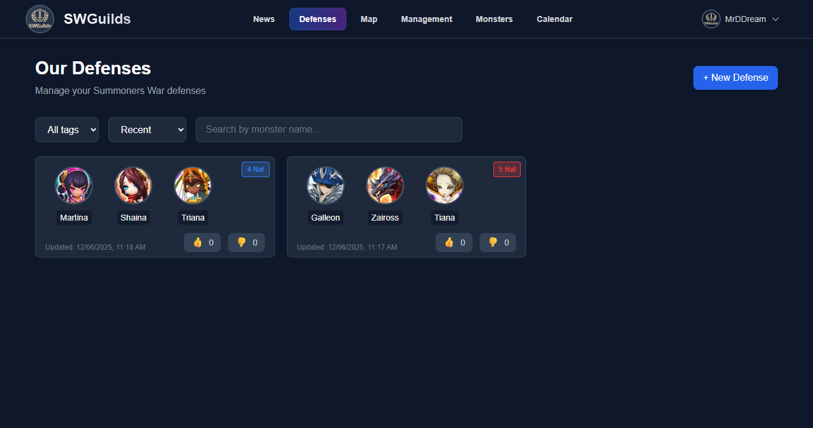 |
| 🔐 **Administration** - Personalisation | 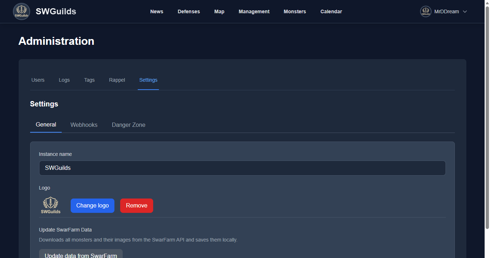 |
| 🛡️ **Map** - Liste des tours | 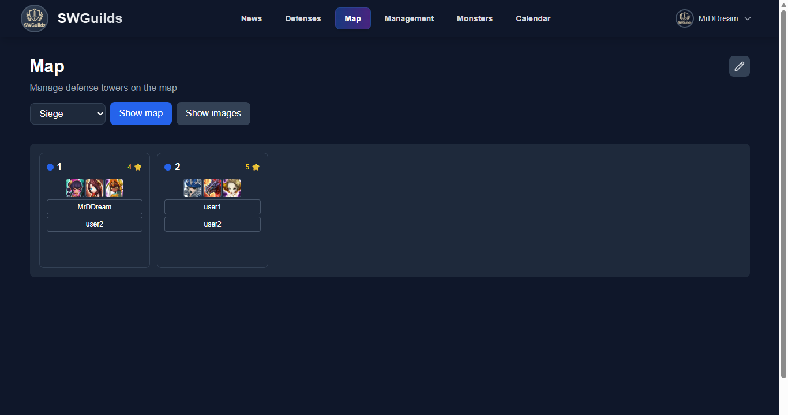 |
| 👥 **Gestion** - Gestion des affectations | 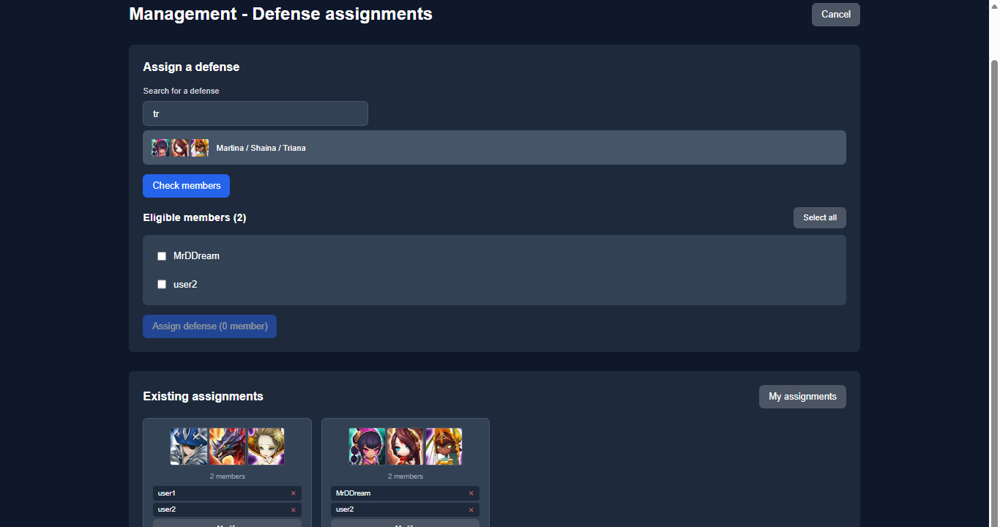 |
| 🗺️ **Carte** - Carte de guilde interactive | 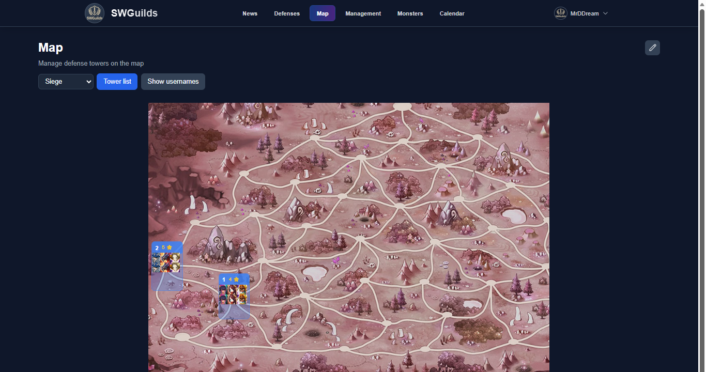 |
| 👹 **Monstres** - Base de données des monstres | 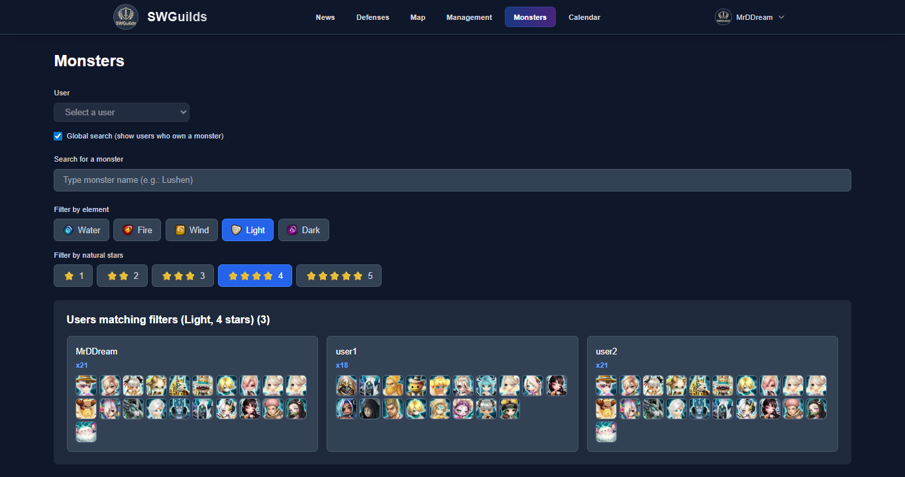 |
|  📅 **Calendrier** - Vue mensuelle | 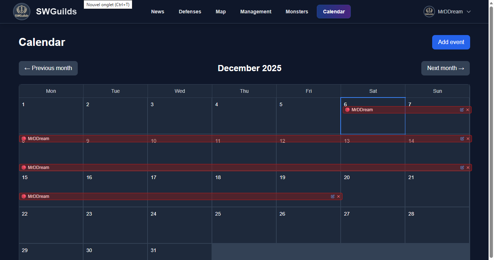 |
| 🔐 **Profil** - Profil utilisateur | 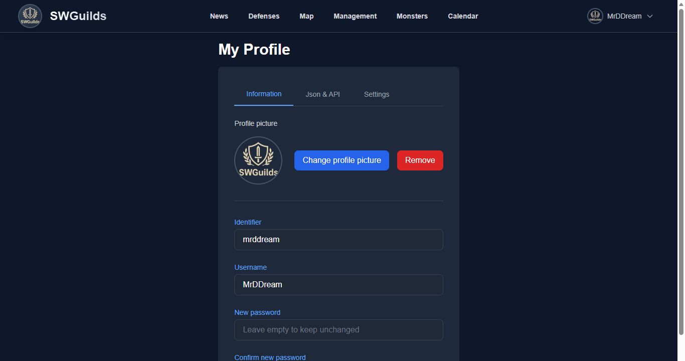 |
| 🔧 **Administration** - Panel d'administration | 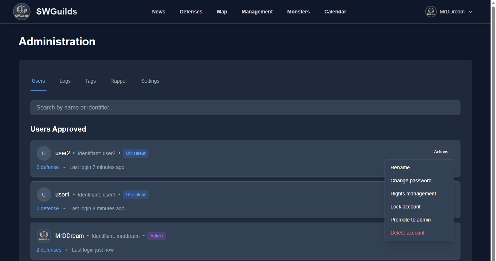 |
| 🔧 **Administration** - Gestion des utilisateurs | 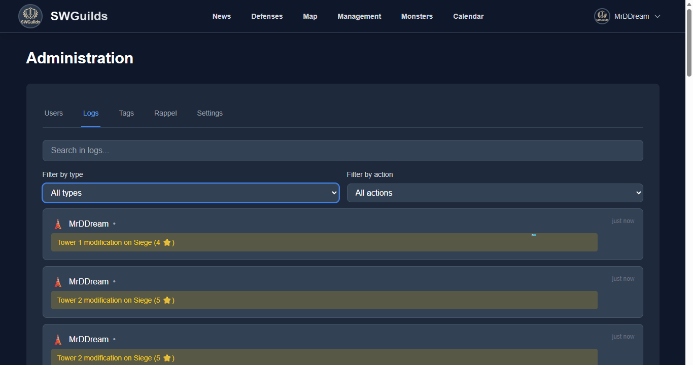 |
| 🔧 **Administration** - Paramètres | 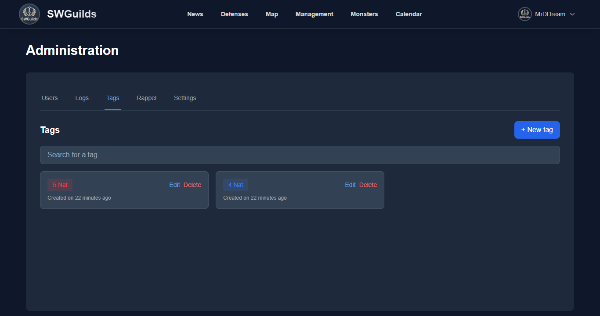 |
| 👤 **Profil** - Profil utilisateur | 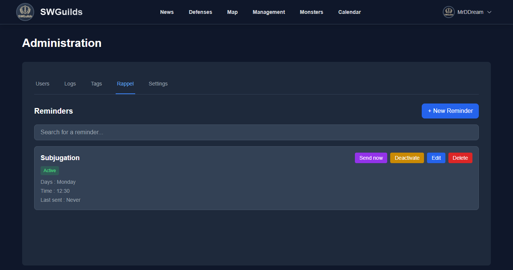 |

---

## 🚀 Installation rapide avec Docker

La méthode la plus simple pour déployer SWGuilds est d'utiliser l'image Docker pré-construite disponible sur GitHub Container Registry.

### Prérequis

- Docker et Docker Compose installés
- Un fichier `.env` configuré (voir [Configuration](#-configuration))

### Étapes d'installation

1. **Téléchargez le fichier `docker-compose.yml`** :

```bash
curl -O https://raw.githubusercontent.com/votre-repo/SWGuilds/main/docker-compose.yml
```

Ou clonez le repository :

```bash
git clone https://github.com/votre-repo/SWGuilds.git
cd SWGuilds
```

2. **Créez votre fichier `.env`** :

```bash
cp .env.example .env
```

3. **Configurez les variables d'environnement** (voir section [Configuration](#-configuration))

4. **Lancez l'application** :

```bash
docker-compose -f docker-compose-prod.yml up -d
```

5. **Accédez à l'application** :

Ouvrez votre navigateur à l'adresse : `http://votre-ip:3020` (ou le port configuré dans `EXTERNAL_PORT`)

Pour utiliser l'applicationn après la mise en ligne aller dans **Administration** -> **Paramètres** -> **Mettre à jour depuis SwarFarm** (cela téléchargera les informations et les îcones en local, ce bouton doit être utilisé par exemple lors d'ajout de nouveaux monstres).

### Volumes Docker

L'application utilise des volumes Docker nommés pour persister les données :

- `prisma_data` : Base de données SQLite
- `data_public` : Fichiers uploadés (logos, cartes, avatars, etc.)

Ces volumes sont automatiquement créés lors du premier démarrage.

---

## ⚙️ Configuration

### Variables d'environnement

Créez un fichier `.env` à la racine du projet avec les variables suivantes :

#### Variables requises

```env
# Locale
LOCALE=fr
# Timezone
TIMEZONE=Europe/Paris
# Admin (optionnel - pour créer automatiquement un compte admin)
ADMIN_ID=admin
ADMIN_PASSWORD=change-me
ADMIN_NAME=Admin
# External PORT
EXTERNAL_PORT=3020
# Database
DATABASE_URL="file:./prisma/dev.db"
# NextAuth
NEXTAUTH_URL="http://localhost:3000"
NEXTAUTH_SECRET="change-this-secret-in-production"
```

### Génération de NEXTAUTH_SECRET

Pour générer un secret sécurisé :

```bash
openssl rand -base64 32
```

### Configuration du compte administrateur

Le compte créé via les variables d'environnement (`ADMIN_ID`, `ADMIN_PASSWORD`, `ADMIN_NAME`) est **protégé** et ne peut pas être modifié par d'autres administrateurs. Il ne peut pas être :

- Supprimé
- Verrouillé/déverrouillé
- Renommé
- Rétrogradé (changement de rôle)
- Modifié (changement de mot de passe par d'autres admins)

**Important** : Si vous ne configurez pas ces variables, vous devrez créer un compte admin manuellement via la base de données.

### Configuration des webhooks Discord

Dans le panel d'administration, vous pouvez configurer :

- **Webhook Discord pour absences** : Notifications automatiques lors de la création d'absences
- **Webhook Discord pour actualités** : Publication automatique des posts sur Discord

Pour obtenir l'URL d'un webhook Discord :

1. Allez dans les paramètres de votre serveur Discord
2. Intégrations → Webhooks → Nouveau webhook
3. Copiez l'URL du webhook

---

## 📖 Utilisation

### Première connexion

1. Accédez à l'application via votre navigateur
2. Cliquez sur "S'inscrire" si vous n'avez pas de compte
3. Remplissez le formulaire d'inscription
4. Attendez l'approbation par un administrateur (si nécessaire)
5. Connectez-vous avec vos identifiants

### Création d'une défense

1. Allez dans "Défenses" → "Créer une défense"
2. Sélectionnez les 3 monstres de votre défense
3. Remplissez les informations (forces, faiblesses, séquence d'attaque)
4. Ajoutez des tags si nécessaire
5. Cliquez sur "Créer"

### Ajout d'un contre

1. Ouvrez une défense
2. Allez dans l'onglet "Contres"
3. Cliquez sur "Ajouter un contre"
4. Sélectionnez les monstres du contre
5. Ajoutez des notes
6. Enregistrez

### Utilisation du calendrier

1. Allez dans "Calendrier"
2. Cliquez sur "Ajouter un évènement"
3. Sélectionnez le type (Absence ou Autre)
4. Choisissez les dates de début et de fin
5. Ajoutez une note optionnelle
6. Enregistrez

Les événements multi-jours s'affichent automatiquement sur plusieurs lignes.

### Configuration de la carte

1. Allez dans "Carte"
2. Sélectionnez le mode (Normal ou Tournoi)
3. Cliquez sur une tour pour la configurer
4. Déplacez et redimensionnez les tours avec la souris
5. Assignez des défenses et des utilisateurs
6. Les positions sont sauvegardées automatiquement

### Gestion des utilisateurs (admin)

1. Allez dans "Administration"
2. Section "Utilisateurs"
3. Approuvez, modifiez les permissions ou supprimez des utilisateurs
4. Configurez les permissions granulaires selon les besoins

---

## 🛠️ Technologies utilisées

### Stack principal

- **[Next.js 14](https://nextjs.org/)** : Framework React avec App Router
- **[TypeScript](https://www.typescriptlang.org/)** : Typage statique
- **[Prisma](https://www.prisma.io/)** : ORM pour la base de données
- **[SQLite](https://www.sqlite.org/)** : Base de données
- **[NextAuth.js](https://next-auth.js.org/)** : Authentification
- **[Tailwind CSS](https://tailwindcss.com/)** : Styling
- **[React](https://react.dev/)** : Bibliothèque UI

### Dépendances principales

- `react-draggable` : Drag & drop pour la carte
- `react-resizable` : Redimensionnement des tours
- `react-markdown` : Rendu Markdown pour les notes
- `bcryptjs` : Hashage des mots de passe

---

## 🔧 Maintenance et dépannage

### Voir les logs Docker

```bash
# Logs en temps réel
docker-compose -f docker-compose-prod.yml logs -f

# Logs des 100 dernières lignes
docker-compose -f docker-compose-prod.yml logs --tail=100
```

### Sauvegarder la base de données

```bash
# Avec volumes nommés
docker-compose -f docker-compose-prod.yml exec app cp /app/prisma/dev.db /app/prisma/dev.db.backup

# Avec volumes locaux
cp prisma/dev.db prisma/dev.db.backup
```

### Restaurer la base de données

```bash
# Avec volumes nommés
docker-compose -f docker-compose-prod.yml exec app cp /app/prisma/dev.db.backup /app/prisma/dev.db

# Avec volumes locaux
cp prisma/dev.db.backup prisma/dev.db
```

### Mettre à jour l'image Docker

```bash
# Arrêter le container
docker-compose -f docker-compose-prod.yml down

# Télécharger la nouvelle image
docker-compose -f docker-compose-prod.yml pull

# Redémarrer
docker-compose -f docker-compose-prod.yml up -d
```

### Redémarrer l'application

```bash
docker-compose -f docker-compose-prod.yml restart
```

### Problèmes courants

#### L'application ne démarre pas

1. Vérifiez les logs : `docker-compose -f docker-compose-prod.yml logs`
2. Vérifiez que le port n'est pas déjà utilisé
3. Vérifiez que le fichier `.env` est correctement configuré
4. Vérifiez les permissions des volumes

#### Erreur de permissions

Si vous avez des erreurs de permissions avec les volumes :

```bash
# Ajuster les permissions (Linux)
sudo chown -R 1001:1001 ./prisma ./public/uploads
```

#### La base de données ne se crée pas

1. Vérifiez que le volume `prisma_data` existe : `docker volume ls`
2. Vérifiez les logs pour les erreurs de migration
3. Supprimez le volume et recréez-le si nécessaire

#### Les images ne se chargent pas

1. Vérifiez que le volume `data_public` existe
2. Vérifiez les permissions du dossier `public/uploads`
3. Vérifiez les logs pour les erreurs de chargement

---

## 📞 Support

### Issues GitHub

Pour signaler un bug ou demander une fonctionnalité, ouvrez une issue sur GitHub.

### Documentation

La documentation complète est disponible dans le repository.

### Contact

Pour toute question ou support, contactez l'équipe de développement.

---

<div align="center">
  <p>Made with ❤️ for Summoners War guilds</p>
  <p>© 2024 SWGuilds - Tous droits réservés</p>
</div>

